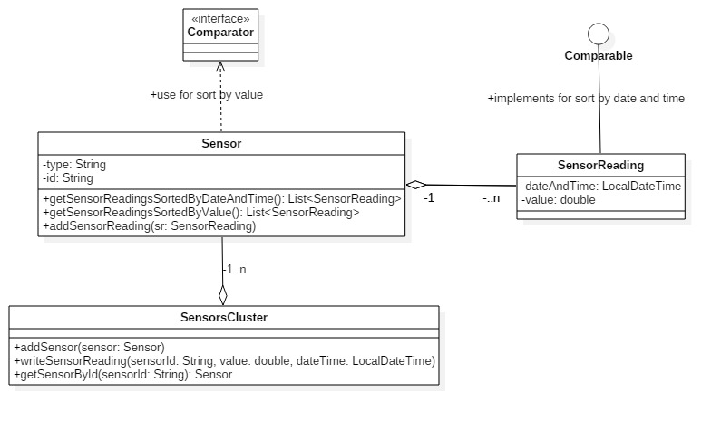
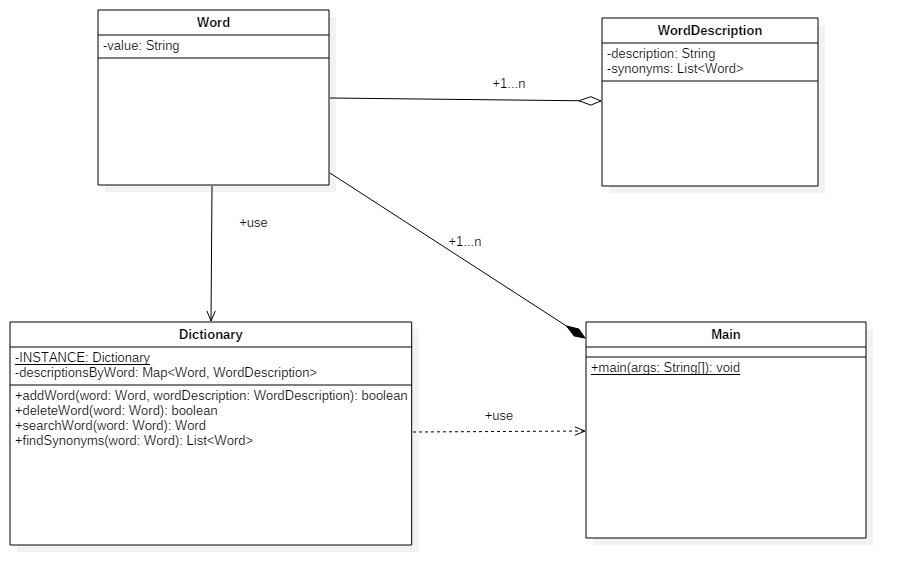

# Implement the following exercises

In this lab you will create small Java applications by using as reference an UML class diagram. Please consider following general notes before start implementing:
- toString() method when required will return a string like *ClassName{attributeName1=attributeValue1,...,attributeName=attributeValue}*.
- Do not reuse (import) the same class in multiple exercises. **Each exercise is standalone and should be resolved in its package.**

## Exercise 1


Given the UML class diagram above, implement the corresponding Java program.

1. Create Java class based on the diagram above. 
    * _SensorReading_ should offer comparing possibility by implementing ```Comparable<SensorReading>```
    * _Sensor_ should offer comparing possibility using ```Comparator<Sensor>```
2. Demonstrate the functionality of application in Exercise1 class main method.
3. Create minimal unit tests for testing the behavior of the program.

**Note 1: Constructors and setter\getter methods are not represented in the diagram but can\should be implemented."**

**Note 2: You can add any extra methods if required.**


## Exercise 2


Given the UML class diagram above, implement the corresponding Java program.

1. Create Java class based on the diagram above
    * _addWord_ method should override existing word if already exists. If synonyms are provided, all synonyms should already be in the dictionary. Method should return true if the word was successfully added or false if the word already existed.
    * _deleteWord_ should return true if word was found and successfully deleted. 
2. Demonstrate the functionality of application in Exercise1 class main method.
3. Create unit tests for _addWord_, _deleteWord_, _searchWord_, _findSynonyms_ methods.

## Exercise 3


## Exercise 4


## Exercise 5